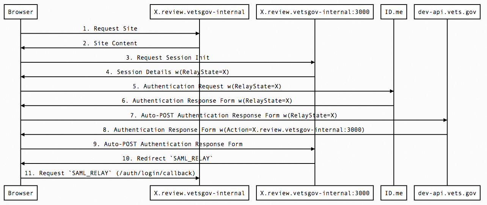

# Review Instances

Review instances are a deployment of a combination of vets-api and vets-website at specified versions.

These are different from Heroku review apps (which will have a URL like https://vetsgov-pr-5306.herokuapp.com). Heroku review apps only serve up our static content; they do not build our React apps and have no connectivity to an API backend. These may be viewed by external stakeholders. Heroku review apps are typically created automatically as part of a vets-website pull request.

Internal review instances are built by Jenkins (these have a url like http://71aaf141c9283eb0f29ded3b967a118c.review.vetsgov-internal) and are connected to an API backend. These require access to the [SOCKS proxy](https://github.com/department-of-veterans-affairs/vets.gov-team/blob/master/Work%20Practices/Engineering/Internal%20Tools.md#configuring-the-socks-proxy) so can not be review by external stakeholders.

Review instances may be created as part of a pull request for the vets-api or vets-website github repositories (automatic), or manually by running a Jenkins job.

<hr>

* [Automatic Creation](#automatic-creation)
* [Manual Creation](#manual-creation)
* [Cleanup](#cleanup)
* [User Authentication](#user-authentication)

<hr>

## Automatic Creation

The Jenkinsfiles in vets-website and vets-api define a stage that triggers a review instance deployment. Opening a PR will trigger the CI process, which will generate a "GitHub Deployment" for the PR. A message on the PR will provide a link to the review instance.

You will need your browser configured to access the vetsgov-internal domain via the SOCKS proxy. Please see the [Internal Tools](internal-tools-access.md) documentation for detailed instructions.

## Manual Creation

1. Visit http://jenkins.vetsgov-internal/job/vets-review-instance-deploy/ and log in.
1. Select ```Build with Parameters```.
1. Specify the branch names for `api_branch` and `web_branch`. These branches will be deployed together with the review instance.
1. When the process is completed, the URL for the review instance will be provided at the end of the output logs.

## Cleanup

A Jenkins job will run periodically and remove review instances for which the source branches no longer exist. To ensure that your instance is cleaned up appropriately, just delete the branch from the origin repository.


## User Authentication

ID.me SAML configuration requires explicitly defining a callback URL via a manual process. This callback URL receives authentication information after a successful authentication process. The review instance requires a special nginx configuration that intercepts the callback to the dev-api.vets.gov server, and forwards the authentication information to the appropriate review instance (mapped by the `RelayState` parameter, which is provided to the review instance vets-api config with the `REVIEW_INSTANCE_SLUG` environment variable).

For implementation specific details, see the [revproxy nginx configuration](https://github.com/department-of-veterans-affairs/devops/blob/master/ansible/roles/revproxy-configure/templates/nginx_revproxy.conf). The following sequence diagram presents an overview of this process:



<hr>

Back: [Internal Tools Access](internal-tools-access.md)

Next: [Deployment](deployment.md)
